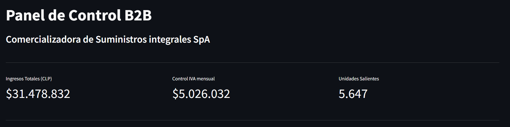
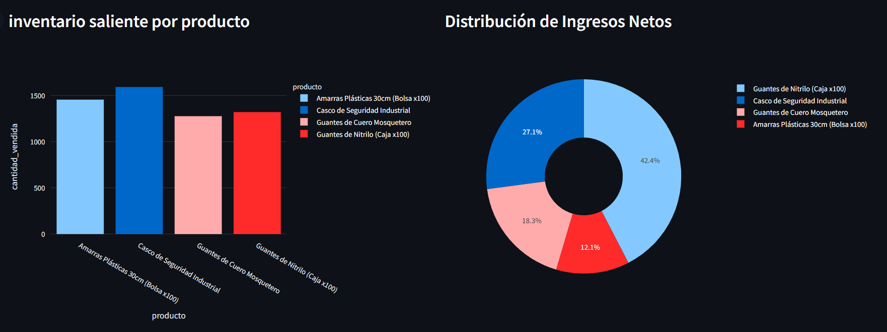
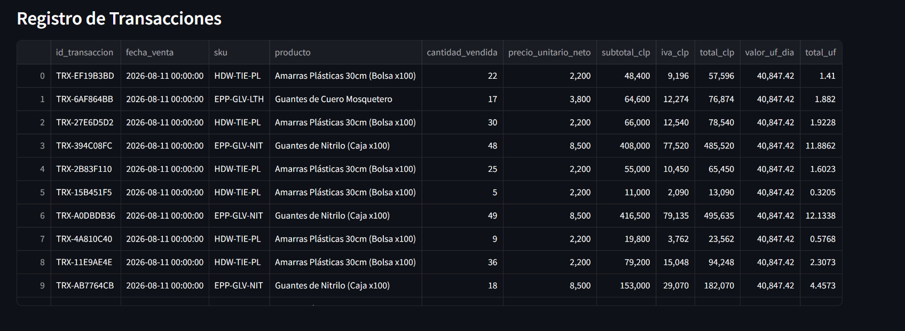

# 📦 B2B Data Pipeline & Inventory Dashboard


## 📌 Visión General
Este proyecto es una solución integral de ingeniería de datos (*End-to-End*) diseñada para la gestión operativa y financiera de **Comercializadora de Suministros Integrales SpA**. 

El sistema automatiza el procesamiento de ventas de inventario B2B, asegura el almacenamiento histórico en la nube y despliega métricas críticas de negocio (como ingresos netos y control de IVA mensual) en una interfaz interactiva de baja latencia.

> **Nota de Arquitectura:** Al tratarse de un panel de control B2B que maneja datos financieros sensibles (ingresos, control de IVA), el entorno de visualización está diseñado intencionalmente para ejecutarse en redes locales privadas (On-Premise) a través de contenedores Docker, garantizando que la información estratégica no quede expuesta en URLs públicas.

## Visualización del Dashboards




## 🏗️ Arquitectura de Datos
El proyecto implementa un patrón de arquitectura moderna separando la capa de almacenamiento (Data Lake) de la capa de servicio, garantizando escalabilidad y alta disponibilidad.

1. **Extracción y Transformación (ETL):** Un pipeline en Python procesa y limpia los datos crudos de transacciones.
2. **Data Lake (AWS S3):** Los datos procesados se respaldan de manera inmutable en Amazon S3, asegurando un *Disaster Recovery* eficiente y un almacenamiento histórico de bajo costo.
3. **Capa de Servicio (PostgreSQL):** Los datos estructurados se ingestan en una base de datos relacional para permitir consultas analíticas rápidas y optimizadas.
4. **Visualización (Streamlit):** Un Panel de Control B2B interactivo que consume datos directamente desde PostgreSQL, mostrando KPIs clave (Ingresos, Control de IVA mensual, Unidades Salientes) y gráficos del flujo de inventario por producto desarrollados con Plotly.

## 🛠️ Stack Tecnológico
* **Lenguaje Principal:** Python
* **Orquestación y Contenedores:** Docker & Docker Compose
* **Base de Datos:** PostgreSQL
* **Cloud Storage:** Boto3 (AWS S3)
* **Manipulación de Datos:** Pandas, SQLAlchemy, psycopg2
* **Frontend Analytics:** Streamlit, Plotly Express

## 📂 Estructura del Repositorio
```text
## 📂 Estructura del Repositorio

```text
├── .devcontainer/             # Configuración de entorno de desarrollo (opcional)
├── dashboards/
│   └── dashboard.py           # Aplicación principal de Streamlit
├── data/
│   ├── processed/             # Datos procesados listos para ingesta (.gitkeep)
│   └── raw/                   # Archivos CSV crudos de entrada para el ETL
├── docker/
│   ├── docker-compose.yml     # Orquestación de servicios (Streamlit + BD)
│   └── Dockerfile             # Imagen del entorno de la aplicación
├── docs/
│   ├── imagen1.png            # Capturas de pantalla para la documentación
│   ├── imagen2.png            
│   └── imagen3.png            
├── powerbi/                   # (Extra) Dashboard alternativo en formato .pbix
├── src/
│   ├── extract/               # Módulos de extracción de datos (generador_b2b.py)
│   ├── load/                  # Módulos de carga a Data Lake (s3_uploader.py)
│   ├── transform/             # Módulos de limpieza (data_cleaner.py)
│   └── api.py                 # Conexión a base de datos PostgreSQL
├── .env.example               # Plantilla segura de variables de entorno
├── .gitignore                 # Archivos y carpetas ignorados por seguridad
├── LICENSE                    # Licencia del proyecto
├── main.py                    # Script principal que orquesta el pipeline ETL
├── README.md                  # Documentación del proyecto
└── requirements.txt           # Dependencias de Python
```

## Configuración y Ejecución Local
El entorno de la aplicación y la base de datos están completamente dockerizados. La instalación de las dependencias (`requirements.txt`) se realiza automáticamente al construir la imagen de Docker.

### 1. Clonar el repositorio y configurar el entorno
Descarga el proyecto y crea un entorno virtual local para ejecutar el pipeline ETL sin afectar tu sistema:
```bash
git clone https://github.com/ctobar96/b2b-inventory-pipeline.git

cd b2b-inventory-pipeline

# Crear y activar entorno virtual
python -m venv venv
source venv/bin/activate  # En Windows usa: venv\Scripts\activate

# Instalar dependencias
pip install -r requirements.txt
```

### 2. Configuración de AWS y Variables de Entorno
Debes crear un bucket en AWS S3 y un usuario IAM con permisos de escritura. Luego, crea un archivo `.env `en la raíz del proyecto basándote en `.env.example`:

``` bash
AWS_ACCESS_KEY_ID=tu_access_key
AWS_SECRET_ACCESS_KEY=tu_secret_key
POSTGRES_USER=usuario
POSTGRES_PASSWORD=password
POSTGRES_DB=inventario_db
POSTGRES_PORT=5432
DB_HOST=b2b_postgres
```
### 3. Levantar la Infraestructura (Docker)
Inicia la base de datos PostgreSQL y el servidor de Streamlit con un solo comando:

``` bash
cd docker
docker compose up -d --build
``` 
(El dashboard estará disponible en http://localhost:8501, pero estará vacío hasta que ejecutes el pipeline). 

### 4. Ejecutar el Pipeline ETL
Para procesar los datos crudos, subirlos a tu bucket de AWS S3 y cargar la tabla en PostgreSQL, ejecuta el script ETL desde tu entorno local:

``` bash
### 3. Ejecutar el Pipeline ETL
Para procesar los datos crudos, subirlos a tu bucket de AWS S3 y cargar la tabla en PostgreSQL, ejecuta el script principal desde tu entorno local:
```bash
# Vuelve a la raíz del proyecto
cd ..
# Ejecuta el pipeline
python main.py
``` 
Una vez que el script finalice exitosamente, recarga el dashboard en tu navegador para ver las métricas actualizadas.

## Próximos Pasos (Roadmap)
- [ ] Implementar modelos de Machine Learning (ej. predicción de series de tiempo) consumiendo los datos crudos directamente desde AWS S3.

- [ ] Agregar validación de calidad de datos usando Great Expectations en el paso del ETL.

- [ ] Incorporar filtros interactivos de fecha (Date Picker) en la barra lateral del dashboard.

## 👨‍💻 Autor

**Cristian Tobar Morales**  
*Data Scientist | Analytics Engineer*

Especialista en análisis de datos, ingeniería de datos y desarrollo de soluciones basadas en datos. Este proyecto forma parte de mi portafolio técnico y tiene como objetivo demostrar la implementación de un pipeline de datos utilizando herramientas modernas de Data Engineering y Cloud.

### 🔗 Contacto

* **LinkedIn:** [Cristian Tobar Morales](#)
* **GitHub:** [@ctobar96](https://github.com/ctobar96)

---

## 📄 Licencia

Este proyecto está disponible bajo la **Licencia MIT**.

Puedes utilizar, modificar y adaptar este proyecto como base para tus propios pipelines de datos, proyectos de análisis o soluciones de ingeniería de datos, de acuerdo con los términos establecidos en la licencia.
